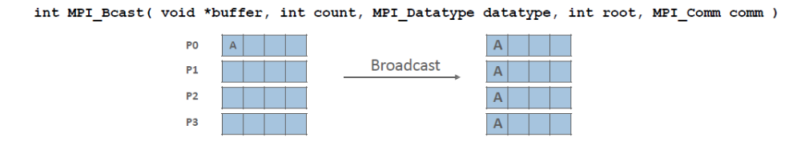
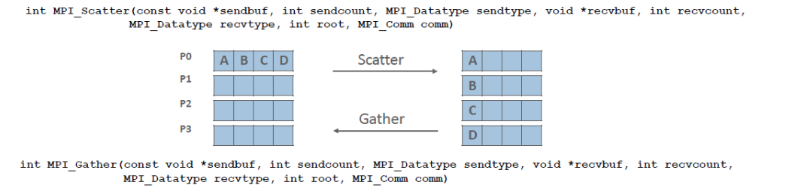

# MPI

## Comunicação Coletiva

- Refere-se à comunicação e à computação coordenada entre um grupo de processos em um comunicador;

- Tags não são usadas; comunicadores diferentes produziriam uma funcionalidade similar;

- Geralmente as operações coletivas são não bloqueantes;

- Podem ser divididas em três tipos de operações: `sincronização`, `movimento dos dados` e `computação coletiva`;

### Bcast

Faz o broadcast entre os processos.

### Scatter e Gather

Distribui ou recolhe entre processos.

